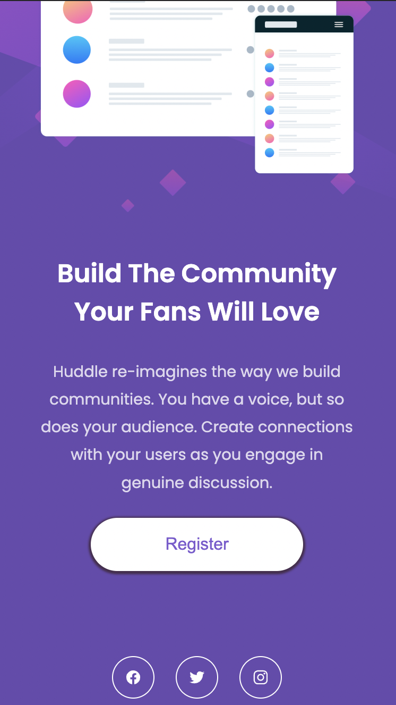

# Frontend Mentor - Huddle landing page with single introductory

---

## Table of Content

* [Useful Links](#useful-links)
* [Mobile version](#mobile)
* [Desktop version](#desktop)

---

### Useful Links 

* [FM - Huddle landing page with single introductory](https://www.frontendmentor.io/challenges/huddle-landing-page-with-a-single-introductory-section-B_2Wvxgi0)

* [Vercel: My Solution](https://fm-08-huddle-landing-page-with-single-introductory-section.vercel.app/)

--- 
### Mobile version 

--- 
### Desktop version 

